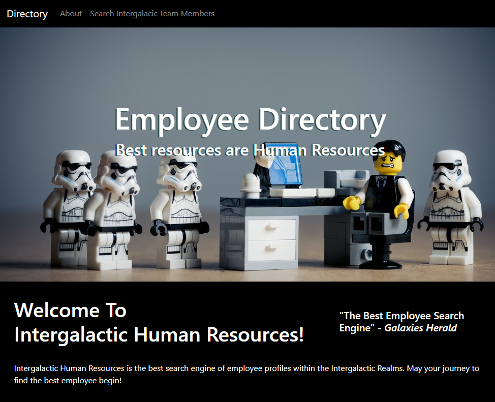

# Employee Directory    

## Description 
 
Employee Directory is a React.js application that allows the user to filter employees by Galaxy and then order then alphabetically.  

## Table of Contents 

* [Usage](#usage-information) 

* [Installation](#installation-instructions) 

* [License](#license) 

* [Where to Contribute](#where-to-contribute) 

* [Tests](#tests) 

* [Repository](#repository) 

* [URL](#url) 

* [Questions](#questions) 

* [Screenshots](#screenshots) 

## Usage Information 
 
    This application should be easy and intutitive to use. Open the URL below and click visit the employee directory filter engine to select the galaxy and then sort.  

## Installation Instructions 
 
    npm i  

## License 
 
This application is covered under this license: MIT

    
## Where to Contribute 
 
Contributions to this project are possible to the GitHub repository below. 

## Tests 
 
npm run test 

## Repository 
 
This repository is hosted in GitHub and you may access it at [https://github.com/johnsbrook/16_Employee_Directory](https://github.com/johnsbrook/16_Employee_Directory). 

## URL 
 
[Employee Directory](https://johnsbrook.github.io/16_Employee_Directory/) 

## Questions 
 
GitHub: [johnsbrook](https://github.com/johnsbrook) 
 
Email: [ivan.zapata.rivera@gmail.com](mailto:ivan.zapata.rivera@gmail.com)

## Screenshot 
 
 
 
